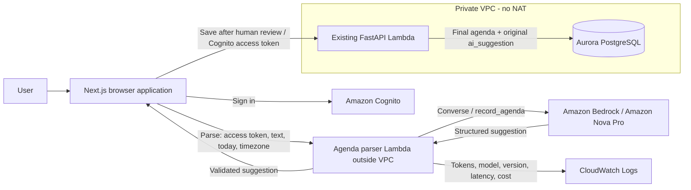

# Containers (C4 level 2)

```mermaid
flowchart LR
    User[User] --> Browser[Next.js browser application]
    Browser -->|Sign in| Cognito[Amazon Cognito]
    Browser -->|Parse: access token, text, today, timezone| Parser[Agenda parser Lambda outside VPC]
    Parser -->|Converse / record_agenda| Bedrock[Amazon Bedrock / Amazon Nova Pro]
    Bedrock -->|Structured suggestion| Parser
    Parser -->|Validated suggestion| Browser
    subgraph VPC[Private VPC - no NAT]
      API[Existing FastAPI Lambda]
      Aurora[(Aurora PostgreSQL)]
      API -->|Final agenda + original ai_suggestion| Aurora
    end
    Browser -->|Save after human review / Cognito access token| API
    Parser -->|Tokens, model, version, latency, cost| Logs[CloudWatch Logs]
```

Parse never writes. Save uses the existing owner-scoped meeting create/update endpoints.
